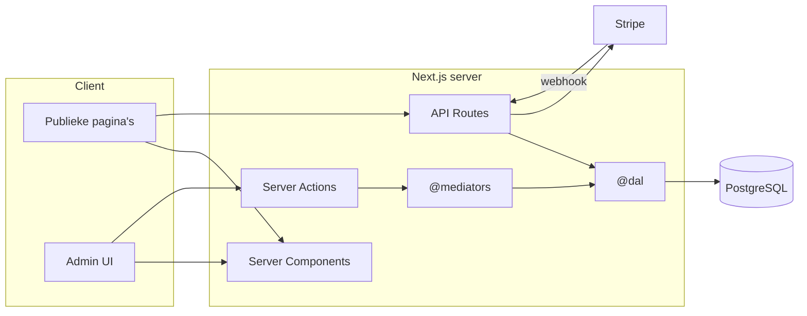
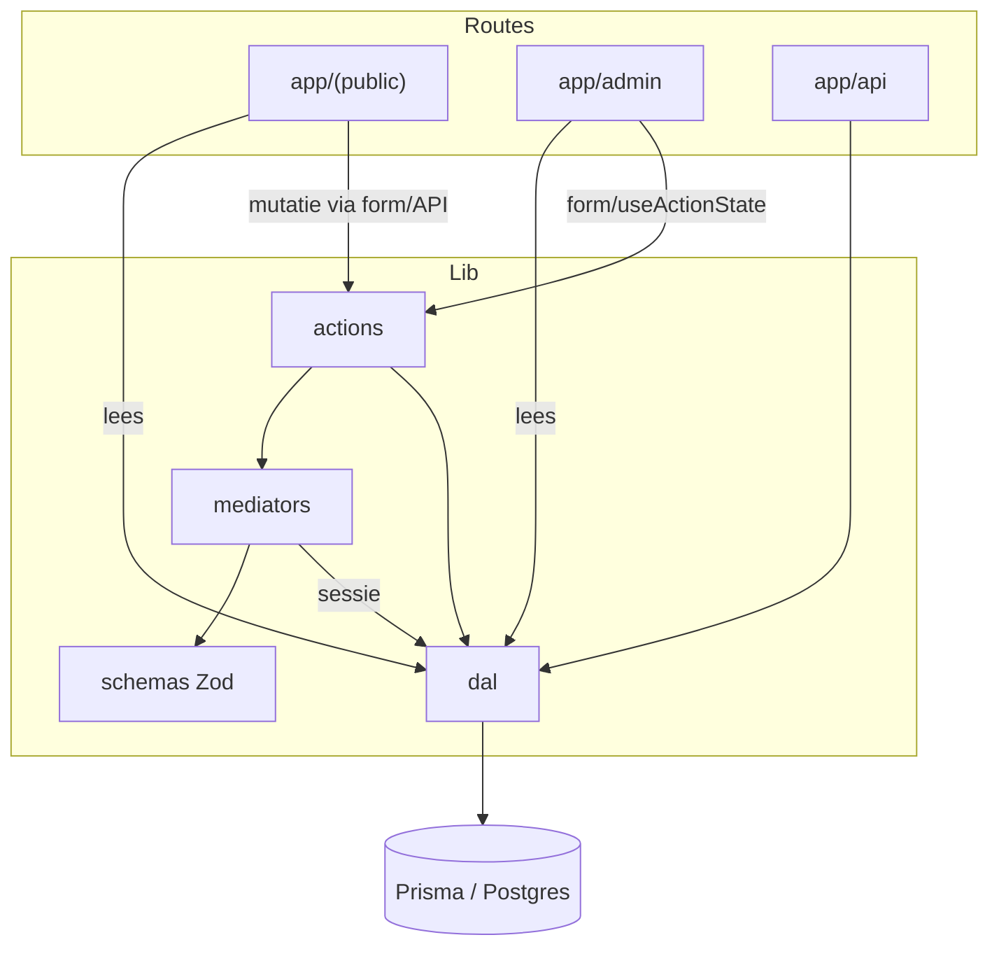
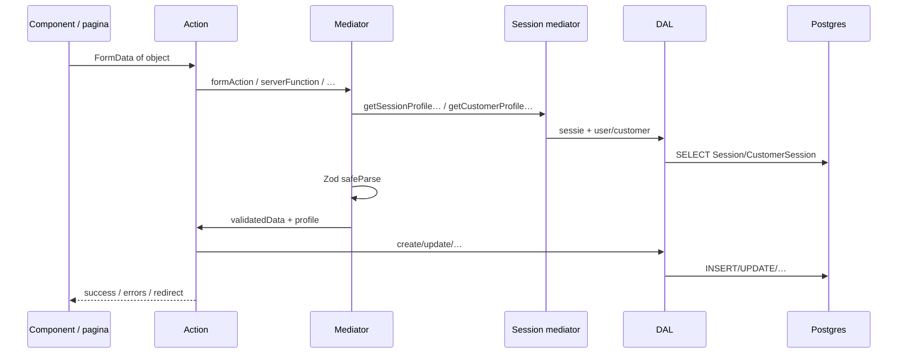
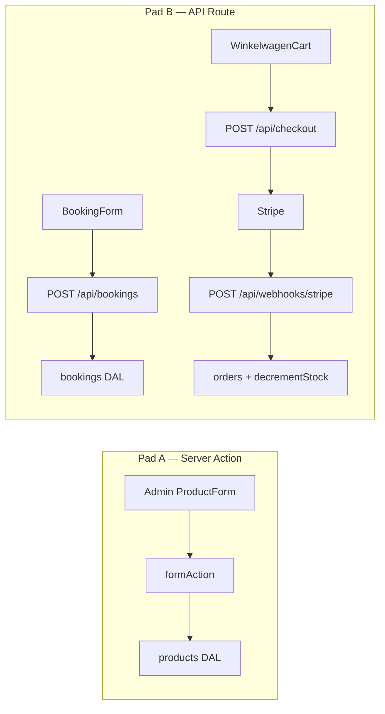
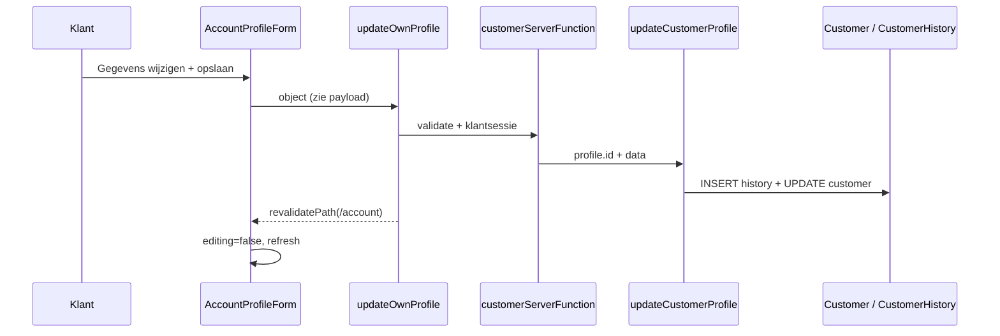
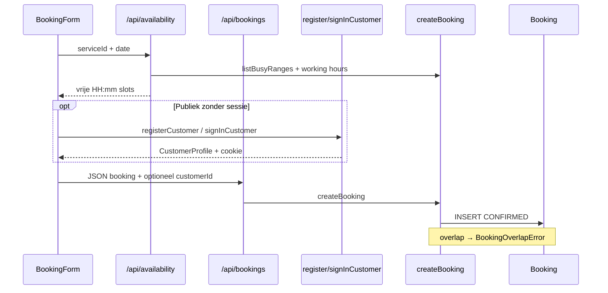
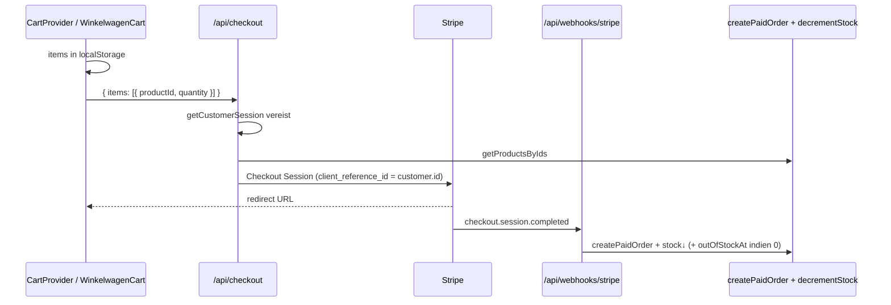
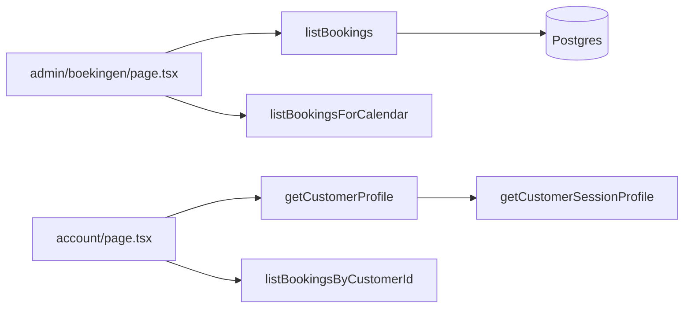
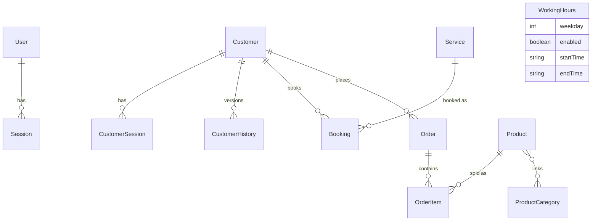

# Bliss — Beauty by Norah

## Beschrijving van de applicatie

**Bliss** is de website van een schoonheidssalon: publiek diensten bekijken,
afspraken boeken, producten kopen en een eigen klantaccount beheren; achter
`/admin` beheert de salonhouder diensten, producten, boekingen, bestellingen,
klanten en openingsuren.

| Publiek | Beheer (`/admin`) |
|---------|-------------------|
| Homepage, diensten, contact | Dashboard |
| Webshop + winkelwagen (Stripe) | Producten, merken, categorieën |
| Online boeken (tijdsloten) | Boekingen + weekkalender |
| Klantaccount (profiel, boekingen, bestellingen) | Klanten (geregistreerd + gasten) |
| ICS-kalenderfeed (Outlook / Proton) | Bestellingen, openingsuren, wachtwoord |

**Kernideeën**

- Twee gescheiden authenticaties: **beheerder** (`User`/`Session`) en
  **klant** (`Customer`/`CustomerSession`) — geen gedeelde login.
- Boekingen worden **direct bevestigd**; een Postgres exclusion constraint
  (`bookings_no_overlap`) voorkomt overlappingen, ook bij gelijktijdige requests.
- Webshoporders ontstaan **pas na succesvolle Stripe-betaling** (webhook),
  zodat er geen spookorders van afgebroken checkouts blijven staan.
- Productfoto’s staan als bytes in Postgres (eenvoudig, geen aparte storage).
- Klantprofielwijzigingen volgen **SCD2**: de vorige status gaat naar
  `CustomerHistory`; accountverwijdering is GDPR-anonimisatie (`deletedAt`).

---

## Tech stack

| Laag | Keuze |
|------|--------|
| Framework | **Next.js 16** (App Router, React 19, Server Components + Server Actions) |
| Taal | **TypeScript** |
| Database | **PostgreSQL** via **Prisma 7** + `@prisma/adapter-pg` |
| Betalingen | **Stripe** Checkout + webhooks |
| Validatie | **Zod** (`@schemas`) |
| Formulieren (admin) | **react-hook-form** + `useActionState` |
| Styling | **Tailwind CSS 4**; **shadcn/ui** vooral in `/admin` |
| Auth | Eigen sessies in DB + httpOnly cookies (bcrypt) |
| Hosting-intentie | Gratis tiers (lokaal Docker / Supabase Postgres, Vercel/Netlify hobby) |



---

## Handleiding

### 1. Postgres

**Lokaal (Docker)**

```bash
docker compose up -d
```

`DATABASE_URL` in `.env` wijst naar `localhost:5432`.

**Of productie-Postgres** (bv. Supabase): zet de connection string als
`DATABASE_URL` (transaction pooler, poort 6543, werkt goed op serverless).

### 2. Schema & beheerder

```bash
pnpm install
npx prisma migrate deploy
pnpm run create-admin -- jouw@email.be een-sterk-wachtwoord
# optioneel voorbeelddata:
npx prisma db seed
```

Schema wijzigen: pas `prisma/schema.prisma` aan en draai
`npx prisma migrate dev --name <omschrijving>`. Na `prisma generate` de
Next-devserver **volledig herstarten** (geen hot-reload van de Prisma-client).

### 3. Stripe

1. Test keys: `STRIPE_SECRET_KEY`, `NEXT_PUBLIC_STRIPE_PUBLISHABLE_KEY`.
2. Lokaal: `stripe listen --forward-to localhost:3000/api/webhooks/stripe`
   → `STRIPE_WEBHOOK_SECRET`.
3. Productie: webhook-endpoint `checkout.session.completed` op
   `https://<domein>/api/webhooks/stripe`.

### 4. Environment variables

```bash
DATABASE_URL=postgresql://...
STRIPE_SECRET_KEY=sk_test_...
NEXT_PUBLIC_STRIPE_PUBLISHABLE_KEY=pk_test_...
STRIPE_WEBHOOK_SECRET=whsec_...
CALENDAR_FEED_SECRET=<lang-willekeurig-geheim>
NEXT_PUBLIC_SITE_URL=http://localhost:3000
```

### 5. Lokaal starten

```bash
pnpm run dev
```

- Site: [http://localhost:3000](http://localhost:3000)
- Admin: `/admin/login`

### 6. Deployen (kort)

Importeer de repo op Vercel/Netlify, zet dezelfde env-vars, draai
`npx prisma migrate deploy` tegen productie-DB, maak een admin-account aan,
configureer het Stripe-webhookendpoint.

### 7. Kalenderfeed (ICS)

`https://<domein>/api/calendar/<CALENDAR_FEED_SECRET>` — behandel als wachtwoord.
Abonneren in Outlook of Proton Calendar (eenrichtingsfeed, periodieke poll).

### 8. Wat kan je doen als beheerder?

| Module | Functie |
|--------|---------|
| Diensten | CRUD, actief/inactief, categorieën |
| Producten | CRUD, foto, merk/eenheid, filters Alle / Actief / Uitverkocht |
| Boekingen | Weekkalender, lijst (aankomend/verleden/alle/geannuleerd), annuleren, walk-in |
| Bestellingen | Status (betaald/verzonden/…) |
| Klanten | Geregistreerd + gasten, geo-stats, gast→account koppelen |
| Kalender | Openingsuren per weekdag |
| Account | Wachtwoord wijzigen |

### 9. Wat kan een klant?

Registreren/inloggen bij boeken of afrekenen; op `/account` profiel
**bekijken** (read-only) en via **Gegevens wijzigen** aanpassen; eigen
toekomstige boekingen annuleren; account GDPR-anonimiseren.

---

## Technische documentatie

### Applicatiestructuur

```
prisma/                     schema, migraties, seeds
scripts/                    create-admin.ts
src/
  app/
    (public)/               Homepage, diensten, winkel, boeken, account, …
    admin/
      (auth)/login/         Admin-login
      (protected)/          Dashboard, CRUD-modules (vereist admin-sessie)
    api/                    checkout, webhooks, bookings, availability, …
  components/               Publieke UI + admin/ + custom/ + ui/ (shadcn)
  lib/
    server/
      dal/                  Prisma-queries (@dal) — enige DB-toegang
      actions/              Server Actions (@actions)
      mediators/            Zod + sessie-wrappers (@mediators)
      utils/                cookies, bcrypt, FormData (@serverUtils)
    models/                 Domeintypes (@models)
    schemas/                Zod-schemas (@schemas)
    hooks/                  o.a. useZodValidatedForm (@hooks)
  proxy.ts                  Guard: /admin* vereist admin-sessie
  generated/prisma/         Gegenereerde client (niet committen)
```



### Server: mediators, actions, DAL

Drie lagen, bewust gescheiden:

| Laag | Alias | Rol |
|------|-------|-----|
| **Schemas** | `@schemas` | Inputvorm (Zod): wat mag de client sturen? |
| **Mediators** | `@mediators` | Validatie + auth + uniforme `ServerFunctionResponse` |
| **Actions** | `@actions` | Domeinlogica: revalidate, redirect, roept DAL |
| **DAL** | `@dal` | Enige plek met Prisma-calls |



#### Mediator-wrappers

| Functie | Auth | Input | Gebruik |
|---------|------|-------|---------|
| `formAction` | Admin | `FormData` → `useActionState` | Admin-CRUD-formulieren |
| `serverFunction` | Admin | plain object | Bind-acties (delete, cancel) |
| `customerServerFunction` | Klant | plain object | Profiel, eigen boeking annuleren |
| `customerFormAction` | Klant | `FormData` | (klaar voor klant-forms) |
| `publicFormAction` | Geen | `FormData` | Admin-login |

Sessie-mediators:

- **Admin:** `getSession` → `getSessionProfile` → `getSessionProfileOrRedirect` /
  `getSessionProfileAndOptionallyExtend` (verlengt cookie indien nodig).
- **Klant:** `getCustomerSession` → `getCustomerProfile` → …zelfde patroon met
  `CUSTOMER_SESSION_*` cookies.

#### DAL — overzicht per domein

| Module | Belangrijkste functies |
|--------|------------------------|
| `users.ts` | Admin login-sessie, wachtwoord, `isActive` |
| `customers.ts` | Registratie, sessie, lijsten, geo-stats, SCD2-update, anonimisatie, gasten |
| `services.ts` / `categories.ts` | Diensten + categorieën |
| `products.ts` / `productAttributes.ts` | Producten, stock/`outOfStockAt`, merken, inhoudseenheden |
| `bookings.ts` | Aanmaken, overlap, lijsten (timeframes), status |
| `orders.ts` | Paid order na webhook, status, klantorders |
| `workingHours.ts` | Openingsuren per weekdag |

#### Twee mutatiepaden

Niet alles loopt via Server Actions:



---

### Architectuur & dataflow (kernscenario’s)

#### 1. Profiel wijzigen (pagina → Prisma)

**UI:** `/account` → `AccountProfileForm` (eerst read-only; knop opent form).

**Hooks in `AccountProfileForm`**

| Hook | Doel | Geeft door / bewaart |
|------|------|----------------------|
| `useState` | edit-modus, veldwaarden, error/saved | lokale form state |
| `useTransition` | pending tijdens opslaan | `pending` voor disabled knop |
| `useRouter` | na succes `router.refresh()` | verse Server Component data |

**Payload → Zod → DAL**

```
{
  email, firstName, lastName, phone?,
  street, houseNumber, postalCode, city, country
}
```

| Stap | Functie |
|------|---------|
| Action | `updateOwnProfile` (`customers.ts`) |
| Mediator | `customerServerFunction` + `updateCustomerProfileSchema` |
| Sessie | `getCustomerProfileAndOptionallyExtend` |
| DAL | `updateCustomerProfile` → archiveert naar `CustomerHistory`, update `Customer` |



Account verwijderen: `DeleteAccountButton` → `deleteOwnAccount` →
`anonymizeCustomer` + cookie wissen.

#### 2. Boeking aanmaken

**UI:** `BookingForm` op `/boeken` of `/admin/boekingen/nieuw`.

**Hooks (selectie)**

| Hook | Doel |
|------|------|
| `useState` | dienst, datum, slots, klantvelden, accountMode, … |
| `useEffect` | bij datumwijziging: `GET /api/availability` → slots |
| `useMemo` | gefilterde klantenlijst (admin) |

**Flow**



**Create-payload (vereenvoudigd):** serviceId, startsAt, klantnaam/email/phone,
notes, optioneel customerId — gevalideerd met `createBookingSchema`.

#### 3. Webshopcheckout



**Cart-item structuur (client):** `{ productId, name, priceCents, quantity, imageUrl }`.

#### 4. Admin product CRUD

**UI:** `ProductForm` (`useActionState`, `useZodValidatedForm`).

| Hook | Doel | Geeft door |
|------|------|------------|
| `useActionState(action, initial)` | server round-trip | `serverResponse` (errors/success) |
| `useZodValidatedForm(schema)` | clientvalidatie | `form.register`, `formState.errors` |
| Child: `EntitySelect` / `CategoryPicker` | inline create merk/categorie | verborgen form fields |

```
FormData → productFormServerSchema
  → createProduct / updateProduct (formAction + admin sessie)
  → products DAL (incl. outOfStockAt bij stock ≤ 0)
  → Product + ProductCategoryLink
```

#### 5. Leespad (Server Component → DAL)

Veel pagina’s lezen **direct** uit de DAL (geen action):



---

### Componenten & hooks (referentie)

| Component | Hooks | Wat ze doorgeven |
|-----------|-------|------------------|
| `AccountProfileForm` | `useState`, `useTransition`, `useRouter` | edit-toggle; form fields → `updateOwnProfile` |
| `AccountLoginForm` | `useState`, `useTransition` | email/wachtwoord → `signInCustomer` |
| `BookingForm` | `useState`, `useEffect`, `useMemo` | slots via availability-API; submit via bookings-API |
| `WinkelwagenCart` | `useCart`, `useState`, `useTransition` | checkout POST; auth via `register`/`signIn` |
| `AddToCartButton` | `useCart` | `addItem(...)` |
| `CartProvider` | `useState`, `useEffect`, `useCallback`, `useMemo` | items ↔ `localStorage`; context value |
| `ProductForm` / `ServiceForm` | `useActionState`, `useZodValidatedForm` | FormData → create/update actions |
| `DeleteButton` | `useTransition` | bound `serverFunction` (cancel/delete) |
| `CancelOwnBookingButton` | `useState`, `useTransition` | `cancelOwnBooking({ id })` |
| `DeleteAccountButton` | `useState`, `useTransition` | `deleteOwnAccount` |
| `PhoneField` / `AddressFields` | lokale `useState` / controlled props | waarde omhoog via `onChange` |
| `Header` | `useCart`, `usePathname` | itemCount badge; navigatie |

Admin-formulieren delen het patroon:
**client Zod (`useZodValidatedForm`) → `useActionState` → `formAction` → DAL**.

---

### Domeinmodellen (kort)



- **`outOfStockAt`:** gezet wanneer `stockQuantity` op 0 komt; gewist bij restock.
- **`BookingTimeframe`:** `upcoming` \| `past` \| `all` \| `cancelled`
  (geannuleerd zit niet in de andere filters).
- **Gastklant:** boeking/order zonder `customerId`; admin kan later linken.

---

### Ontwerpkeuzes (kritisch)

| Keuze | Waarom | Let op |
|-------|--------|--------|
| Eigen auth i.p.v. Auth-as-a-Service | Eenvoud, gratis, volle controle | Zelf sessies/cookies beheren |
| Foto’s in Postgres | Geen storage-service | Telt mee in DB-limiet |
| Orders pas na webhook | Geen spookorders | Webhook moet betrouwbaar bereikbaar zijn |
| Exclusion constraint voor boekingen | Race-safe | Niet in Prisma-schema uitdrukbaar → SQL-migratie |
| Klantaccounts verplicht bij boeken/checkout | Traceerbaarheid, GDPR-profiel | Admin walk-in kan zonder account-UI |
| SCD2 op klantprofiel | Audit van adreswijzigingen | History groeit mee met edits |

De vroegere aanname “geen klantaccounts” is **achterhaald**: publiek
registreren/inloggen bestaat; admin blijft een apart `User`-model.
